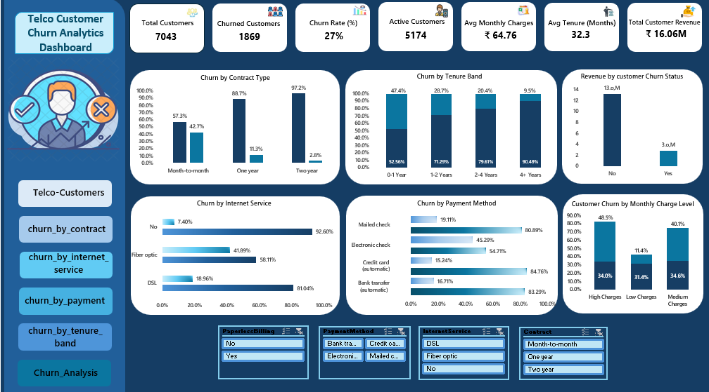

# Telco Customer Churn Analysis

A customer analytics project using **SQL and Microsoft Excel** to measure churn, identify high-risk customer segments, and analyse how contract type, tenure, payment method, internet service, and monthly charges relate to customer retention.

## Project Summary

Customer churn reduces recurring revenue and increases the cost of replacing lost customers.

This project analyses **7,043 telecom customer records** to:

- Measure overall customer churn
- Identify customer segments with higher churn rates
- Compare churn across contract and service types
- Analyse the relationship between tenure and churn
- Examine churn patterns across payment methods
- Build an interactive Excel dashboard for retention analysis

> This analysis identifies patterns and associations in the available customer data. It does not establish the exact reason an individual customer cancelled their service.

## KPI Snapshot

| KPI | Result |
|---|---:|
| Total Customers | 7,043 |
| Churned Customers | 1,869 |
| Active Customers | 5,174 |
| Churn Rate | 27% |
| Average Monthly Charges | 64.76 |
| Average Tenure | 32.3 months |
| Total Customer Revenue | 16.06M |

> Currency symbols are not displayed because the dataset does not identify a specific currency.

## Business Problem

A telecom company needs to understand which customer groups have higher churn rates so that retention efforts can be focused effectively.

Without structured churn analysis, decision-makers may struggle to:

- Measure the overall churn rate
- Identify high-risk customer groups
- Compare churn by contract type
- Understand how customer tenure relates to retention
- Examine churn across payment and service categories
- Prioritise customers for retention campaigns

The objective of this project was to convert customer-level telecom data into clear KPIs, churn segments, dashboard visualisations, and practical retention recommendations.

## Tools Used

| Tool | Purpose |
|---|---|
| **SQL** | Data querying, aggregation, KPI calculation, and churn analysis |
| **Microsoft Excel** | Data preparation, PivotTable analysis, charts, and dashboard development |

## Dataset

The dataset contains **7,043 telecom customer records** with information including:

- Customer ID
- Gender
- Senior Citizen status
- Partner and dependent status
- Tenure
- Phone and internet services
- Contract type
- Payment method
- Monthly charges
- Total charges
- Churn status

These fields were used to analyse customer behaviour and compare churn rates across demographic, account, payment, and service segments.

## Data Preparation

Before analysis, the data was reviewed and prepared using Excel and SQL by:

- Checking customer identifiers
- Reviewing missing and inconsistent values
- Validating numerical and categorical fields
- Standardising fields used in the analysis
- Preparing churn categories and customer segments
- Validating KPI totals before dashboard creation

## Analysis Workflow

1. Imported and reviewed the telecom customer dataset
2. Prepared and validated the data in Excel
3. Used SQL to calculate churn KPIs
4. Analysed churn across contract, tenure, payment, and service categories
5. Exported relevant analysis outputs to Excel
6. Created PivotTables and charts
7. Built an interactive customer churn dashboard
8. Developed retention insights and recommendations

## Excel Dashboard

### Telco Customer Churn Dashboard

The dashboard provides a consolidated view of:

- Total customers
- Churned and active customers
- Overall churn rate
- Average monthly charges
- Average customer tenure
- Churn by contract type
- Churn by tenure group
- Churn by internet service
- Churn by payment method
- Customer and revenue metrics



### Excel Analysis File

The complete Excel workbook containing the analysis and dashboard is available here:

[Download the Excel Analysis File](reports/Telco_Customer_Churn_Data_Analysis.xlsx)

## Key Business Insights

- **1,869 of 7,043 customers churned**, producing an overall churn rate of approximately **27%**.
- Customers on **month-to-month contracts** recorded higher churn than customers on longer-term contracts.
- Customers using **electronic check** showed a higher churn rate than several other payment-method groups.
- Customers with shorter tenure, particularly those in the earlier stages of their relationship with the company, showed higher churn risk.
- Churn varied across monthly-charge segments, indicating that pricing and perceived service value may require closer examination.
- Customers with longer tenure showed stronger retention than newer customers.
- Churn patterns differed across contract, payment, tenure, and service categories, suggesting that a single retention strategy may not be effective for every customer segment.

## Business Recommendations

### Prioritise month-to-month customers

Target month-to-month customers with contract-upgrade incentives, loyalty benefits, or personalised offers that encourage longer commitments.

### Strengthen early-tenure retention

Introduce onboarding support, service check-ins, and targeted offers during the first year of the customer relationship.

### Review electronic-check churn

Investigate whether customers using electronic check experience payment difficulties, service dissatisfaction, or other issues requiring further analysis.

### Monitor high-charge customer segments

Review the services, support experience, and perceived value offered to customer groups with comparatively high monthly charges.

### Use segment-based retention campaigns

Create different retention strategies for customers based on contract type, tenure, payment method, internet service, and monthly-charge group.

### Track churn KPIs regularly

Use the Excel dashboard to monitor total churn, segment-level churn, active customers, tenure, and customer revenue consistently.

## Project Structure

```text
Telco-Customer-Churn-Analysis/
│
├── dashboard/       # Excel dashboard screenshot
├── data/            # Telecom customer dataset
├── presentation/    # Project presentation
├── reports/         # Excel analysis and dashboard workbook
├── sql/             # SQL queries used for churn analysis
└── README.md        # Project documentation
```

## Skills Demonstrated

- SQL Data Analysis
- Data Cleaning
- Data Validation
- Data Aggregation
- KPI Calculation
- Customer Churn Analysis
- Customer Segmentation
- Retention Analysis
- Microsoft Excel
- PivotTables
- Dashboard Development
- Data Visualisation
- Business Insight Generation
- Business Recommendation Development

## Project Outcome

This project demonstrates how telecom customer data can be transformed into a structured churn-monitoring solution. The analysis highlights customer groups with higher churn rates and supports more focused retention strategies across contract, tenure, payment, and service segments.
